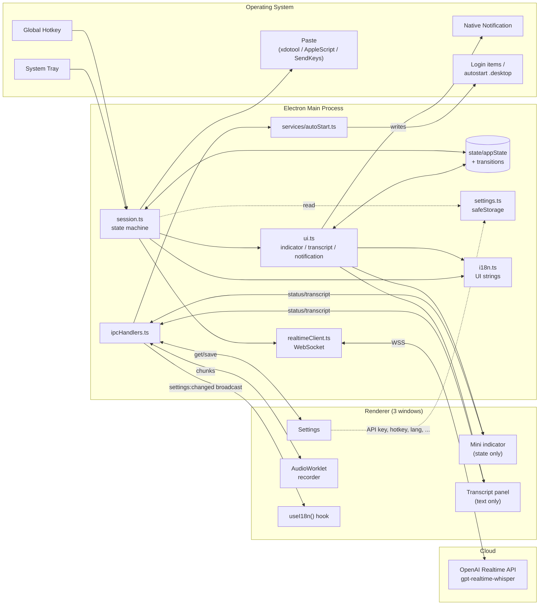

# WhisperAnywhere

[日本語](README.md) | **English**

A desktop app that takes voice input from a global hotkey, transcribes it in real time, and pastes the result straight into whichever app currently has focus.

Email, chat, browser, editor, Claude Code, ChatGPT — type by voice anywhere.

[](https://github.com/TakanariShimbo/whisper-anywhere/releases)
[](#license)

---

## Table of Contents

- [Features](#features)
- [Supported Platforms](#supported-platforms)
- [Install](#install)
- [First Launch and Basic Usage](#first-launch-and-basic-usage)
- [Settings](#settings)
- [Troubleshooting](#troubleshooting)
- [Architecture](#architecture)
- [Development](#development)
- [Releasing](#releasing)
- [Known Limitations and Roadmap](#known-limitations-and-roadmap)
- [License](#license)

---

## Features

- **Global hotkey** to start / stop recording. Works from any app you're focused on.
- **Real-time transcription** via OpenAI Realtime API (`gpt-realtime-whisper`). Partial transcripts stream live into a centred panel as you speak.
- **Auto-paste** into the focused input — clipboard plus a synthesized Ctrl/⌘+V (Linux: `xdotool` / macOS: AppleScript / Windows: PowerShell SendKeys).
- **Three single-purpose windows**: bottom-right status indicator (state only), centred transcript panel (text only), settings window.
- **Settings GUI**:
  - API key encrypted at rest via OS Keychain
  - Hotkey captured by actually pressing the desired combo
  - **Transcription language** (auto / ja / en / zh / ko / es / fr / de / it / pt / ru)
  - **UI language switch** (Japanese / English, applied instantly without restart)
  - **Launch at OS login** (macOS / Windows / Linux; defaults to ON on first launch)
- **Errors surface as native OS notifications** — they don't get buried under the indicator label.
- **Single-instance lock**: launching a second copy quietly exits and surfaces the running instance's settings window.
- **Restart from tray**: one-click `app.relaunch()` for when the app gets into a bad state.
- **Builds for three OSes**: Linux (AppImage / .deb), macOS (dmg, arm64 + x64), Windows (NSIS installer).

---

## Supported Platforms

| OS | Support | Requirements |
|---|---|---|
| Linux (X11) | ✅ | `xdotool` (pulled in automatically by the .deb) |
| Linux (Wayland) | ❌ | Not yet supported. `ydotool` integration is on the roadmap |
| macOS 12+ (Intel / Apple Silicon) | ✅ | Microphone permission + Accessibility permission |
| Windows 10 / 11 | ✅ | Built-in PowerShell (pre-installed) |

---

## Install

Latest builds are on the [Releases](https://github.com/TakanariShimbo/whisper-anywhere/releases) page.

### Linux

**Debian / Ubuntu (.deb)** — recommended. Registers in Activities and auto-installs `xdotool`.

```bash
sudo apt install ./whisper-anywhere_<version>_amd64.deb
```

**AppImage** — portable executable that runs on any distribution.

```bash
# xdotool is required for auto-paste under X11
sudo apt install xdotool

chmod +x WhisperAnywhere-<version>.AppImage
./WhisperAnywhere-<version>.AppImage
```

> AppImages don't show up in the OS app list by default. Use `appimagelauncher` to integrate, or prefer the `.deb` if you want Activities search to find it.

### macOS

| CPU | File |
|---|---|
| Apple Silicon (M1/M2/M3/M4) | `WhisperAnywhere-<version>-arm64.dmg` |
| Intel | `WhisperAnywhere-<version>.dmg` |

1. Open the dmg, drag into Applications.
2. First launch shows an **unsigned app warning** — `Control+click → Open` to bypass it.
3. Approve the microphone and accessibility permission prompts.
   - After the fact: System Settings → Privacy & Security → Accessibility, enable **WhisperAnywhere** (needed for auto-paste).

### Windows

Download `WhisperAnywhere-Setup-<version>.exe` and run.

- SmartScreen will warn — choose **More info → Run anyway** (the binary is unsigned).
- After installation it appears in the Start menu.

---

## First Launch and Basic Usage

1. A microphone icon appears in the system tray.
2. **The settings window opens automatically** — enter your OpenAI API key and save.
3. **Launch-at-login is enabled automatically** (first launch only; you can toggle it back off any time).
4. Default hotkey: `Ctrl+Shift+Space`.
5. Place your cursor in any input.
6. **Press the hotkey** → the indicator flips to "Listening" and the centre transcript panel appears.
7. Speak — the transcript fills in live.
8. **Press the hotkey again** → "Finalizing…" → "Pasting…" → the text lands in the focused input → "Done".

```text
┌──────────────────────────────────────────────────────────┐
│                                                          │
│            ┌────────────────────────────┐                │
│            │   Hello, this is a test…   │  ← centre: transcript panel
│            └────────────────────────────┘                │
│                                                          │
│                                                          │
│                              ┌──────────────┐            │
│                              │ ● Listening   │  ← bottom-right: indicator
│                              └──────────────┘            │
└──────────────────────────────────────────────────────────┘
```

Back-to-back recordings work too: press the hotkey again during the "Done" hold and the next session starts immediately.

Tray menu: **Settings… / Restart / Quit**. The Restart item is handy when the app misbehaves.

---

## Settings

Tray icon → "Settings…".

| Field | Behaviour |
|---|---|
| OpenAI API Key | `sk-`-prefixed string. **Encrypted via OS Keychain (`safeStorage`) on save**. Falls back to plaintext JSON with a log warning when Keychain isn't available. |
| Hotkey | Click "Change", press the combo you want, the accelerator string is generated automatically. `Esc` cancels. |
| Transcription language | Hint passed to OpenAI Realtime API (`audio.input.transcription.language`, ISO-639-1). **Auto** lets the model detect. Setting it explicitly improves accuracy and latency (other languages still get recognised). |
| UI language | Switches the app's own UI between Japanese and English. **Applied live, no restart**. Defaults derive from the OS locale (`app.getLocale()`). |
| Launch at login | Auto-start at OS sign-in. macOS / Windows use `app.setLoginItemSettings`; Linux writes `~/.config/autostart/whisper-anywhere.desktop`. **Defaults to ON on first launch** (no-op in dev). |

API key resolution order: **settings file > `OPENAI_API_KEY` env var > none**.

Settings file location:
- Linux: `~/.config/whisper-anywhere/settings.json`
- macOS: `~/Library/Application Support/whisper-anywhere/settings.json`
- Windows: `%APPDATA%\whisper-anywhere\settings.json`

> Launch-at-login state lives at the OS level (not in `settings.json`). If you turn it off in System Settings, the settings window will reflect that the next time you open it.

---

## Troubleshooting

| Symptom | Cause / Fix |
|---|---|
| Hotkey does nothing | Possibly conflicts with another app. Try a different combo. From a terminal run, check that `hotkey: registered: ...` shows in the log. |
| Launching a second copy does nothing | Single-instance lock is doing its job. The existing instance's settings window pops up. |
| Notification says `OPENAI_API_KEY is not set` | Save your key in the settings window. The window auto-opens on this error. |
| Stuck on "Listening" with no text | The terminal log will have a WS error. 401 = invalid key, 429 = rate limit. |
| Microphone capture fails (renderer error) | Check the OS-level mic permission. On Linux, `arecord -l` should list inputs, and confirm another app isn't holding the device. |
| Paste doesn't fire (Linux) | `xdotool` not installed, or a Wayland session. Verify with `echo $XDG_SESSION_TYPE`. |
| Paste doesn't fire (macOS) | Enable WhisperAnywhere under System Settings → Accessibility. |
| Tray icon missing (Linux) | GNOME usually needs the `AppIndicator and KStatusNotifierItem Support` extension. Install + re-login. |
| Won't start (Linux, sandbox error) | Dev environment only: `sudo chown root:root node_modules/electron/dist/chrome-sandbox && sudo chmod 4755 ...` |
| App is misbehaving | Tray → **Restart** for a 1-click recovery. Otherwise `pkill -f whisper-anywhere`. |

Logs go to stdout in this format:

```text
[WA HH:MM:SS.mmm] <category>: <message>
```

Categories: `hotkey` / `status` / `realtime` / `settings` / `notification` / `lifecycle`.

---

## Architecture



### Responsibility Matrix

| Module | Owns | Doesn't own |
|---|---|---|
| `main/state/appState.ts` | Runtime state for session/hotkey (status, busy, client, generation, lastFinal, hotkey accel, paused, lastFired) | UI output, IPC, side effects |
| `main/state/transitions.ts` | Status transition table + validation | Mutating state |
| `main/session.ts` | State-machine actions (start / stop / finalize), hotkey register / pause / resume, Realtime client wiring, paste invocation | UI rendering, file IO |
| `main/ui.ts` | Indicator / transcript / notification output, transition logging, illegal-transition warnings | Business logic, state mutation |
| `main/ipcHandlers.ts` | Channel → handler wiring; applies autoStart and broadcasts UI-language change on save | Logic (delegates to session / settings / autoStart) |
| `main/realtimeClient.ts` | WSS to OpenAI Realtime API, pre-buffer, event parsing, `language` hint injection | Session state, UI |
| `main/settings.ts` | Reads/writes settings JSON, `safeStorage` encryption, env-var fallback, first-launch flag | OS-level autoStart, UI rendering |
| `main/services/autoStart.ts` | OS-specific launch-at-login (macOS/Win: `setLoginItemSettings`; Linux: `.desktop` file), state query | Settings JSON writes |
| `main/i18n.ts` | Process-wide current UI language + bound `t(key, params)` | The translation table itself (lives in `shared/i18n.ts`) |
| `main/windows/factory.ts` | Common overlay window options (frameless, focusable:false, alwaysOnTop, preload wiring) | Per-window content |
| `main/windows/{mini,transcript,settings}.ts` | Size / placement / HTML entry per window | Shared window options |
| `main/paste.ts` | OS-specific paste keystroke synthesis | Anything above the clipboard write |
| `main/tray.ts` | System tray icon + menu (rebuildable on language change) | Actions (passed in as callbacks) |
| `main/hotkey.ts` | Thin wrapper around `globalShortcut` | Wiring to session |
| `main/log.ts` | Timestamped logger + LogCategory | Persistence |

Renderer:

| Module | Owns |
|---|---|
| `renderer/src/{App,components/MiniWindow}` | Status indicator React UI |
| `renderer/src/transcript/*` | Live transcript panel UI, auto-scroll |
| `renderer/src/settings/*` | Settings form, hotkey capture, UI-language toggle |
| `renderer/src/audio/{recorder,useRecorder}` | Mic capture, AudioContext control, IPC of PCM chunks |
| `renderer/public/audio-worklets/pcm-processor.js` | Float32 → Int16 LE conversion, 40 ms chunking, posting to main thread |
| `renderer/src/shared/mountReact.tsx` | Shared React bootstrap for the 3 renderer entries |
| `renderer/src/shared/i18n.ts` | `useI18n()` hook — fetches on mount + re-renders on the `settings:changed` broadcast |

Shared layer:

| Module | Owns |
|---|---|
| `shared/channels.ts` | IPC channel names (main↔renderer in both directions + settings-changed broadcast) |
| `shared/events.ts` | Payload types + `AppStatus` |
| `shared/audio.ts` | Sample rate, chunk sizing |
| `shared/settings.ts` | `AppSettings` / `SettingsUpdate` / `LanguageCode` / `LANGUAGE_OPTIONS` |
| `shared/i18n.ts` | `UILanguage` type, ja / en translation tables, `t(key, lang, params)` |

### IPC channels

Declared in `src/shared/channels.ts`. Naming: `<domain>:<verb>`.

| Channel | Direction | Payload | Purpose |
|---|---|---|---|
| `status:update` | main → renderer | `StatusPayload` | Update the indicator state |
| `transcript:update` | main → renderer | `TranscriptPayload` | Transcript panel body |
| `recording:start` | main → renderer | — | Start mic recording |
| `recording:stop` | main → renderer | — | Stop mic recording |
| `settings:changed` | main → renderer | `UILanguage` | UI language changed — re-render |
| `recording:chunk` | renderer → main | `RecordingChunkPayload` | 40 ms PCM chunk |
| `recording:error` | renderer → main | `RecordingErrorPayload` | Renderer-side error report |
| `settings:get` | renderer → main | — | Read settings (`invoke`) |
| `settings:save` | renderer → main | `SettingsUpdate` | Save settings (`invoke`) |
| `hotkey:pause` | renderer → main | — | Temporarily unregister the global hotkey |
| `hotkey:resume` | renderer → main | — | Re-register the global hotkey |
| `app:quit` | renderer → main | — | Quit |

### State Machine

```text
  ┌────────┐  hotkey   ┌───────────┐  hotkey   ┌──────────────┐
  │  idle  │ ────────► │ listening │ ────────► │ transcribing │
  └────────┘           └───────────┘           └──────┬───────┘
       ▲                     │                        │
       │                     │ error                  │ final
       │                     ▼                        ▼
       │                ┌───────┐               ┌─────────┐
       │  delay         │ error │               │ pasting │
       └──── ─────── ───┤       │               └────┬────┘
       │                └───┬───┘                    │ paste ok
       │                    │                        ▼
       │                    │                   ┌────────┐
       │  delay (long)      │                   │  done  │
       └─────────── ────────┘                   └───┬────┘
                                                   │ delay
                                                   ▼
                                                 idle
```

Full transition table: `src/main/state/transitions.ts`. Tests: `src/main/state/__tests__/transitions.test.ts`.

---

## Development

### Prerequisites

- Node.js 22+ (`.nvmrc` bundled)
- Linux only:
  - SUID-fix `chrome-sandbox` (once, after `npm install`):
    ```bash
    sudo chown root:root node_modules/electron/dist/chrome-sandbox
    sudo chmod 4755 node_modules/electron/dist/chrome-sandbox
    ```
  - Install `xdotool`:
    ```bash
    sudo apt install xdotool
    ```

### Setup

```bash
nvm use
npm ci
```

### Run

```bash
# Once you've saved an API key via the GUI you don't need this env var any more
OPENAI_API_KEY='sk-...' npm run dev
```

If the log shows `[WA ...] hotkey: registered: ...`, the main process started fine.

### Scripts

```bash
npm run dev           # electron-vite dev server
npm run build         # bundle main / preload / renderer into out/
npm run typecheck     # tsc type check (node + web)
npm test              # vitest (state-machine tests)
npm run test:watch    # vitest watch mode

npm run pack:linux    # builds AppImage + .deb
npm run pack:mac      # builds dmg + zip (macOS only)
npm run pack:win      # builds NSIS exe (run on Windows)
```

### Source layout

```text
src/
├─ main/                  # Electron main process
│  ├─ index.ts            # bootstrap + electron lifecycle + single-instance lock
│  ├─ session.ts          # state-machine actions + hotkey wiring
│  ├─ ui.ts               # indicator / transcript / notification
│  ├─ ipcHandlers.ts      # ipcMain registration list
│  ├─ i18n.ts             # current UI language + t() helper
│  ├─ state/
│  │  ├─ appState.ts      # the AppState singleton
│  │  ├─ transitions.ts   # legal transitions + helpers
│  │  └─ __tests__/       # vitest
│  ├─ services/
│  │  └─ autoStart.ts     # per-OS launch-at-login
│  ├─ windows/
│  │  ├─ factory.ts       # overlay window common options
│  │  ├─ mini.ts          # indicator
│  │  ├─ transcript.ts    # transcript panel
│  │  └─ settings.ts      # settings window (singleton)
│  ├─ realtimeClient.ts   # WSS to OpenAI Realtime API (injects language hint)
│  ├─ settings.ts         # safeStorage + JSON persistence
│  ├─ paste.ts            # OS-specific auto-paste
│  ├─ hotkey.ts           # globalShortcut wrapper
│  ├─ tray.ts             # system tray (includes Restart menu item)
│  ├─ log.ts              # timestamped logger + LogCategory
│  ├─ constants.ts        # magic numbers
│  ├─ utils/              # sleep, truncate
│  └─ assets/             # tray / app icon
│
├─ preload/
│  └─ index.ts            # exposes the whisper API via contextBridge
│
├─ renderer/
│  ├─ index.html          # mini
│  ├─ settings.html       # settings
│  ├─ transcript.html     # transcript
│  ├─ public/audio-worklets/pcm-processor.js   # AudioWorklet
│  └─ src/
│     ├─ shared/
│     │  ├─ mountReact.tsx                     # shared React bootstrap
│     │  └─ i18n.ts                            # useI18n() hook
│     ├─ App.tsx, main.tsx                     # mini
│     ├─ components/MiniWindow.tsx
│     ├─ stores/statusStore.ts                 # zustand
│     ├─ audio/{recorder,useRecorder}.ts
│     ├─ settings/{App,main,HotkeyCapture}.tsx
│     ├─ transcript/{App,main}.tsx
│     └─ global.d.ts                           # window.whisper typings
│
└─ shared/
   ├─ channels.ts         # IPC channel names
   ├─ events.ts           # payload types + AppStatus
   ├─ audio.ts            # sample rate, chunk sizing
   ├─ settings.ts         # AppSettings / SettingsUpdate / LanguageCode
   └─ i18n.ts             # UILanguage type + ja / en translations + t()
```

### Testing

```bash
npm test
```

Only pure logic is currently tested (status transition table). E2E (Playwright) is on the roadmap.

---

## Releasing

1. Tag and push:
   ```bash
   git tag v0.4.0
   git push origin v0.4.0
   ```
2. GitHub Actions extracts the version from the tag → syncs `package.json` → builds in parallel on ubuntu / macOS / windows runners → uploads each artifact to a **draft** release.
3. Review the draft on the Releases page → **Publish release**.

> No need to manually bump `package.json` — the workflow syncs it from the tag.

---

## Known Limitations and Roadmap

**Current limitations**

- macOS / Windows builds are **unsigned** (Gatekeeper / SmartScreen warnings).
- Linux Wayland is unsupported (X11 only).
- No transcript history (every session pastes once and is gone).
- No way to start recording other than the hotkey (no click button etc.).

**Roadmap**

- Post-processing modes (punctuation / Markdown / bullet list / Claude Code instruction etc.)
- Persistent history with re-paste
- Wayland support (`ydotool` / `wtype`)
- macOS / Windows code signing
- More UI languages (Chinese, Korean, etc.)

---

## License

TBD (will likely be MIT or similar — to be decided).
