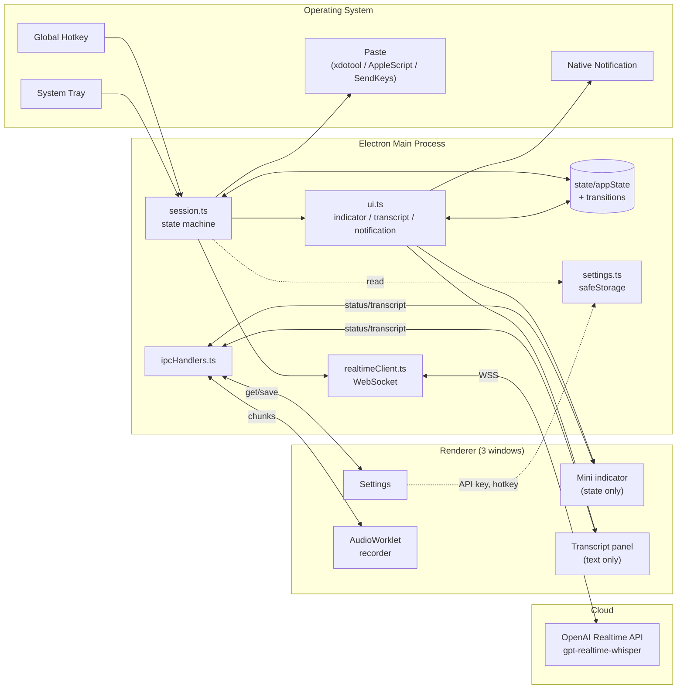

# WhisperAnywhere

ホットキーで音声を入力し、リアルタイムに文字起こしして、いま開いているアプリの入力欄へそのまま貼り付けるデスクトップアプリです。

メール、チャット、ブラウザ、エディタ、Claude Code、ChatGPT — どこでも声で打てる。

[](https://github.com/TakanariShimbo/whisper-anywhere/releases)
[](#ライセンス)

---

## 目次

- [機能](#機能)
- [動作環境](#動作環境)
- [インストール](#インストール)
- [初回起動と基本操作](#初回起動と基本操作)
- [設定](#設定)
- [トラブルシューティング](#トラブルシューティング)
- [アーキテクチャ](#アーキテクチャ)
- [開発](#開発)
- [リリース](#リリース)
- [既知の制限とロードマップ](#既知の制限とロードマップ)
- [ライセンス](#ライセンス)

---

## 機能

- **グローバルホットキー** で録音を開始／停止。どのアプリ上にいても割り込み入力できる
- **リアルタイム文字起こし**（OpenAI Realtime API: `gpt-realtime-whisper`）。話している途中の partial が画面中央のパネルに live で流れる
- **自動貼り付け**。確定文字列はクリップボード経由でフォーカス中の入力欄へ送り込み（Linux: `xdotool` / macOS: AppleScript / Windows: PowerShell SendKeys）
- **役割を分けた 3 つのウィンドウ**: 右下のステータスインジケーター（状態だけ）/ 画面中央の文字起こしパネル（テキストだけ）/ 設定ウィンドウ
- **設定 GUI**: API キーは OS Keychain で暗号化保存、ホットキーは実キー押下から記録
- **エラーは OS ネイティブ通知** で別途表示（インジケーターのメッセージで埋もれない）
- **3 OS パッケージ**: Linux (AppImage / .deb), macOS (dmg, arm64 + x64), Windows (NSIS インストーラ)

---

## 動作環境

| OS | サポート | 必要なもの |
|---|---|---|
| Linux (X11) | ✅ | `xdotool` パッケージ。.deb 経由でインストールすれば自動 |
| Linux (Wayland) | ❌ | 未対応。`ydotool` 経由の対応はロードマップ |
| macOS 12+ (Intel / Apple Silicon) | ✅ | マイク許可 + アクセシビリティ許可 |
| Windows 10 / 11 | ✅ | 標準の PowerShell が使えること（プリインストール） |

---

## インストール

最新ビルドは [Releases](https://github.com/TakanariShimbo/whisper-anywhere/releases) ページから入手できます。

### Linux

**AppImage**（推奨。どのディストロでもそのまま動く）

```bash
# 自動貼り付けに xdotool が必須（X11 環境）
sudo apt install xdotool

# 起動
chmod +x WhisperAnywhere-<version>.AppImage
./WhisperAnywhere-<version>.AppImage
```

**Debian / Ubuntu (.deb)**

```bash
sudo apt install ./whisper-anywhere_<version>_amd64.deb
# xdotool は依存として一緒に入る
```

### macOS

| プロセッサ | ファイル |
|---|---|
| Apple Silicon (M1/M2/M3/M4) | `WhisperAnywhere-<version>-arm64.dmg` |
| Intel | `WhisperAnywhere-<version>.dmg` |

1. dmg を開いて Applications フォルダにドラッグ
2. 初回起動: **未署名アプリ警告** が出るので `Control+クリック → 開く` で承認
3. マイク + アクセシビリティの許可ダイアログを承認
   - 後から: System Settings → Privacy & Security → Accessibility で **WhisperAnywhere** を有効化（自動貼り付けに必要）

### Windows

`WhisperAnywhere-Setup-<version>.exe` をダウンロード → 実行。

- SmartScreen 警告が出たら **詳細情報 → 実行**（未署名のため）
- インストール後はスタートメニューから起動

---

## 初回起動と基本操作

1. システムトレイに **マイクアイコン** が常駐する
2. **設定ウィンドウが自動で開く** ので OpenAI API キーを入力して保存
3. デフォルトホットキーは `Ctrl+Shift+Space`
4. 任意のアプリの入力欄にカーソルを置く
5. **ホットキー押下** → 右下のインジケーターが「聞き取り中」になり、画面中央に文字起こしパネルが出る
6. 話す → パネルにリアルタイムで文字が伸びる
7. **もう一度ホットキー** → 「確定待ち」→「貼り付け中」→ 入力欄に文字が貼り付く → 完了

```text
┌──────────────────────────────────────────────────────────┐
│                                                          │
│            ┌────────────────────────────┐                │
│            │   こんにちは、これはテスト… │  ← 画面中央: 文字起こしパネル
│            └────────────────────────────┘                │
│                                                          │
│                                                          │
│                              ┌──────────────┐            │
│                              │ ● 聞き取り中  │  ← 右下: ステータス
│                              └──────────────┘            │
└──────────────────────────────────────────────────────────┘
```

連続録音もできます: `done` 表示中（完了の余韻）にもう一度ホットキーを押せば、即座に次の録音が始まります。

---

## 設定

トレイアイコン → 「設定…」 で開きます。

| 項目 | 内容 |
|---|---|
| OpenAI API キー | sk- で始まる文字列。**保存時に OS Keychain で暗号化**（`safeStorage`）。Keychain が使えない環境では平文 JSON にフォールバックし警告ログを出す |
| ホットキー | 「変更」ボタン → 設定したいキーの組み合わせを **実際に押す** → アクセラレータ文字列が自動生成。Esc で取消 |

優先度: **設定ファイル > 環境変数 `OPENAI_API_KEY` > なし**

設定ファイルの保存先:
- Linux: `~/.config/whisper-anywhere/settings.json`
- macOS: `~/Library/Application Support/whisper-anywhere/settings.json`
- Windows: `%APPDATA%\whisper-anywhere\settings.json`

---

## トラブルシューティング

| 症状 | 原因 / 対処 |
|---|---|
| ホットキーを押しても反応しない | 別アプリと競合している可能性。設定で違う組み合わせを試す。ターミナル起動ならログに `hotkey: registered: ...` が出ているか確認 |
| `OPENAI_API_KEY が未設定です` と通知が出る | 設定画面で API キーを保存。エラー時は自動で設定窓が開く |
| 「聞き取り中」のまま文字が出ない | ターミナルログに WS のエラーが出ているはず。401 = キー無効 / 429 = レート制限 |
| マイクが拾えない（renderer error） | OS のマイク許可を確認。Linux なら `arecord -l` で入力デバイスが見えるか / 他アプリがマイクを掴んでいないか |
| 貼り付けされない（Linux） | `xdotool` がインストールされていない、または Wayland セッション。`echo $XDG_SESSION_TYPE` で確認 |
| 貼り付けされない（macOS） | System Settings → Accessibility で WhisperAnywhere を有効化 |
| トレイアイコンが見えない（Linux） | GNOME はトレイ拡張が必要なことが多い (`AppIndicator and KStatusNotifierItem Support`)。インストール後に再ログイン |
| 起動できない（Linux: sandbox エラー） | 開発時のみ。`sudo chown root:root node_modules/electron/dist/chrome-sandbox && sudo chmod 4755 ...` |

ログは標準出力に出ます。フォーマット:

```text
[WA HH:MM:SS.mmm] <category>: <message>
```

カテゴリ: `hotkey` / `status` / `realtime` / `settings` / `notification` / `lifecycle`

---

## アーキテクチャ



### 責務マトリクス

| モジュール | 受け持つもの | 受け持たないもの |
|---|---|---|
| `main/state/appState.ts` | session / hotkey の実行時状態（status, busy, client, generation, lastFinal, hotkey accel, paused, lastFired） | UI 出力、IPC、副作用 |
| `main/state/transitions.ts` | status 遷移表 + バリデーション | 状態の変更 |
| `main/session.ts` | 状態機械のアクション（start / stop / finalize）、hotkey の登録／pause／resume、Realtime クライアントへの接続、paste の呼び出し | UI 描画、ファイル IO |
| `main/ui.ts` | indicator / transcript / notification への出力、状態遷移ログ、不正遷移の警告 | 業務ロジック、状態の変更 |
| `main/ipcHandlers.ts` | チャネル名 → ハンドラの紐付け | ロジック（session / settings に委譲） |
| `main/realtimeClient.ts` | OpenAI Realtime API への WSS、pre-buffer、event 解釈 | session の状態、UI |
| `main/settings.ts` | 設定 JSON の読み書き、`safeStorage` 暗号化、環境変数フォールバック | UI 描画 |
| `main/windows/factory.ts` | 共通のオーバーレイウィンドウ設定（frameless, focusable:false, alwaysOnTop, preload 配線） | 各ウィンドウのコンテンツ |
| `main/windows/{mini,transcript,settings}.ts` | 各ウィンドウのサイズ・配置・HTML エントリ指定 | 共通設定 |
| `main/paste.ts` | OS 固有の paste キー合成 | クリップボード書き込みより上のロジック |
| `main/tray.ts` | システムトレイのアイコンとメニュー | アクション（コールバックで受ける） |
| `main/hotkey.ts` | `globalShortcut` の薄いラッパ | session との接続 |
| `main/log.ts` | 時刻付きログ、カテゴリ enum | ストレージ |

レンダラ側:

| モジュール | 受け持つもの |
|---|---|
| `renderer/src/{App,components/MiniWindow}` | ステータスインジケーターの React UI |
| `renderer/src/transcript/*` | 文字起こしパネル UI、自動スクロール |
| `renderer/src/settings/*` | 設定フォーム、ホットキーキャプチャ |
| `renderer/src/audio/{recorder,useRecorder}` | マイク取得、AudioContext 制御、IPC 送信ロジック |
| `renderer/public/audio-worklets/pcm-processor.js` | Float32 → Int16 LE 変換、40ms チャンク化、main thread への post |
| `renderer/src/shared/mountReact` | 3 ウィンドウ共通の React bootstrap |

### IPC チャネル

すべて `src/shared/channels.ts` で定義。命名規則 `<domain>:<verb>`。

| Channel | 向き | Payload | 用途 |
|---|---|---|---|
| `status:update` | main → renderer | `StatusPayload` | インジケータの状態更新 |
| `transcript:update` | main → renderer | `TranscriptPayload` | 文字起こしパネルの本文 |
| `recording:start` | main → renderer | — | 録音開始命令 |
| `recording:stop` | main → renderer | — | 録音停止命令 |
| `recording:chunk` | renderer → main | `RecordingChunkPayload` | 40ms PCM チャンク |
| `recording:error` | renderer → main | `RecordingErrorPayload` | renderer 側エラー報告 |
| `settings:get` | renderer → main | — | 設定読み込み（invoke） |
| `settings:save` | renderer → main | `SettingsUpdate` | 設定保存（invoke） |
| `hotkey:pause` | renderer → main | — | グローバルホットキー一時解除 |
| `hotkey:resume` | renderer → main | — | グローバルホットキー再登録 |
| `app:quit` | renderer → main | — | アプリ終了 |

### 状態機械

```text
  ┌────────┐  hotkey   ┌───────────┐  hotkey   ┌──────────────┐
  │  idle  │ ────────► │ listening │ ────────► │ transcribing │
  └────────┘           └───────────┘           └──────┬───────┘
       ▲                     │                        │
       │                     │ error                  │ final
       │                     ▼                        ▼
       │                ┌───────┐               ┌─────────┐
       │  delay         │ error │               │ pasting │
       └──── ─────── ───┤       │               └────┬────┘
       │                └───┬───┘                    │ paste ok
       │                    │                        ▼
       │                    │                   ┌────────┐
       │  delay (long)      │                   │  done  │
       └─────────── ────────┘                   └───┬────┘
                                                   │ delay
                                                   ▼
                                                 idle
```

詳細と全遷移パターンは `src/main/state/transitions.ts`、テストは `src/main/state/__tests__/transitions.test.ts`。

---

## 開発

### 前提

- Node.js 22+（`.nvmrc` 同梱）
- Linux 開発時のみ:
  - `chrome-sandbox` の SUID 設定（`npm install` 後に一度だけ）
    ```bash
    sudo chown root:root node_modules/electron/dist/chrome-sandbox
    sudo chmod 4755 node_modules/electron/dist/chrome-sandbox
    ```
  - `xdotool` のインストール
    ```bash
    sudo apt install xdotool
    ```

### セットアップ

```bash
nvm use
npm ci
```

### 起動

```bash
# API キーは設定 GUI から保存しておけば再起動後も不要
OPENAI_API_KEY='sk-...' npm run dev
```

ログに `[WA ...] hotkey: registered: ...` が出れば main プロセスは正常起動。

### スクリプト

```bash
npm run dev           # electron-vite dev サーバ
npm run build         # main / preload / renderer を out/ へバンドル
npm run typecheck     # tsc 型チェック (node + web)
npm test              # vitest（state 機械のテスト）
npm run test:watch    # vitest watch

npm run pack:linux    # AppImage + .deb 生成
npm run pack:mac      # dmg + zip 生成（macOS でのみ実行可）
npm run pack:win      # NSIS exe 生成（Windows 推奨）
```

### ソース構成

```text
src/
├─ main/                 # Electron メインプロセス
│  ├─ index.ts           # bootstrap + electron lifecycle
│  ├─ session.ts         # 状態機械のアクション + hotkey 配線
│  ├─ ui.ts              # indicator / transcript / notification
│  ├─ ipcHandlers.ts     # ipcMain 登録の一覧
│  ├─ state/
│  │  ├─ appState.ts     # 唯一の AppState シングルトン
│  │  ├─ transitions.ts  # 合法遷移表 + ヘルパ
│  │  └─ __tests__/      # vitest
│  ├─ windows/
│  │  ├─ factory.ts      # オーバーレイウィンドウの共通設定
│  │  ├─ mini.ts         # インジケーター
│  │  ├─ transcript.ts   # 文字起こしパネル
│  │  └─ settings.ts     # 設定ウィンドウ（シングルトン）
│  ├─ realtimeClient.ts  # OpenAI Realtime API への WSS
│  ├─ settings.ts        # safeStorage 暗号化 + JSON 永続化
│  ├─ paste.ts           # OS 別の自動貼り付け
│  ├─ hotkey.ts          # globalShortcut のラッパ
│  ├─ tray.ts            # システムトレイ
│  ├─ log.ts             # 時刻付きロガー + LogCategory
│  ├─ constants.ts       # マジックナンバー集約
│  ├─ utils/             # sleep, truncate
│  └─ assets/            # tray / app icon
│
├─ preload/
│  └─ index.ts           # contextBridge で whisper API を公開
│
├─ renderer/
│  ├─ index.html         # mini
│  ├─ settings.html      # settings
│  ├─ transcript.html    # transcript
│  ├─ public/audio-worklets/pcm-processor.js   # AudioWorklet
│  └─ src/
│     ├─ shared/mountReact.tsx                 # 3 entry 共通の React bootstrap
│     ├─ App.tsx, main.tsx                     # mini
│     ├─ components/MiniWindow.tsx
│     ├─ stores/statusStore.ts                 # zustand
│     ├─ audio/{recorder,useRecorder}.ts
│     ├─ settings/{App,main,HotkeyCapture}.tsx
│     ├─ transcript/{App,main}.tsx
│     └─ global.d.ts                           # window.whisper の型
│
└─ shared/
   ├─ channels.ts        # IPC チャネル名
   ├─ events.ts          # ペイロード型 + AppStatus
   ├─ audio.ts           # サンプルレート、チャンクサイズ
   └─ settings.ts        # AppSettings / SettingsUpdate
```

### テスト

```bash
npm test
```

純粋なロジックのみテスト対象（現状は status 遷移表）。e2e は将来 Playwright で。

---

## リリース

1. タグを打って push:
   ```bash
   git tag v0.2.0
   git push origin v0.2.0
   ```
2. GitHub Actions が tag から version を抽出 → `package.json` を同期 → ubuntu / macOS / windows ランナーで並行ビルド → **draft** リリースに各成果物を自動アップロード
3. GitHub の Releases 画面で内容を確認 → **Publish release**

> `package.json` の `version` を手動で bump する必要はありません。タグから自動同期されます。

---

## 既知の制限とロードマップ

**現状の制限**

- macOS / Windows ビルドは **未署名**（Gatekeeper / SmartScreen の警告が出る）
- Linux Wayland 未対応（X11 のみ）
- 文字起こし履歴の保存なし（毎回その場で paste のみ）
- ホットキー以外の手段（クリックなど）での録音開始なし

**ロードマップ**

- 文字起こし結果の整形モード（句読点 / Markdown / 箇条書き / Claude Code 指示 など）
- 履歴の永続化と再貼り付け
- OS の自動起動登録
- Wayland 対応（`ydotool` / `wtype`）
- macOS / Windows のコード署名
- 多言語切替（現在は OpenAI 任せの自動判定）

---

## ライセンス

未定（必要に応じて MIT 等を後日設定）。
